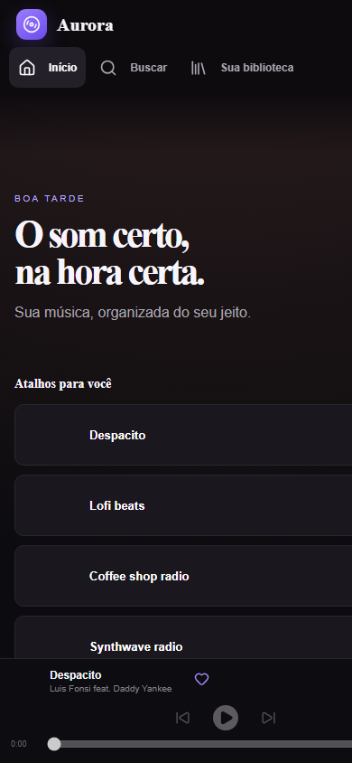

<div align="center">
  
  <h1>Aurora</h1>
  <p><strong>Minha música, organizada do meu jeito.</strong></p>
  <p>Um player pessoal inspirado no que eu gosto nas melhores experiências de streaming, usando o player e as APIs oficiais do YouTube.</p>
</div>

<div align="center">
  <a href="https://pajeeh.github.io/aurora-music/"><strong>Abrir o Aurora</strong></a>
  · <a href="https://pajeeh.github.io/aurora-music/showcase.html"><strong>Conhecer o projeto</strong></a>
  · <a href="https://pajeeh.github.io/aurora-music/beta.html"><strong>Participar do beta</strong></a>
</div>


<p align="center"></p>

## O que já funciona

- login com Google OAuth em modo de testes;
- playlists reais da conta conectada, em modo somente leitura;
- reprodução pelo YouTube IFrame Player oficial;
- play, pausa, faixa anterior/próxima, volume, posição e avanço automático da fila;
- busca real com a conta conectada ou uma chave da YouTube Data API;
- curtidas e fila persistidas no dispositivo;
- layout responsivo para desktop e telas pequenas;
- instalação como aplicativo pelo navegador compatível (PWA);
- Aurora Connect público com fila compartilhada por convite;
- card público “tocando agora” atualizado pelo player real.

## Aurora Now Playing

O aplicativo publica a faixa e o estado de reprodução em um serviço Cloudflare protegido. O SVG público é usado no perfil do GitHub e incorpora a capa da faixa sem expor o token Google. Presença ao vivo expira quando o player deixa de enviar atualizações; o cache de imagens do GitHub pode levar alguns minutos para refletir a mudança.

## Rodando localmente

Requisitos: Node.js 22 ou superior e um projeto no Google Cloud com a **YouTube Data API v3** habilitada.

```bash
npm install
copy .env.example .env.local
npm run dev
```

Preencha `VITE_GOOGLE_CLIENT_ID` no `.env.local`. `VITE_YOUTUBE_API_KEY` é opcional: com a conta conectada, a busca usa o token OAuth. O `.env.local` não é versionado.

```bash
npm test
npm run build
```

## Privacidade e limites

- O áudio e o vídeo são fornecidos pelo player oficial do YouTube.
- O Aurora não baixa nem intercepta mídia.
- O acesso OAuth está em modo de testes e limitado às contas autorizadas no Google Cloud.
- Tokens respeitam a validade informada pelo Google e são descartados quando vencem. O perfil continua lembrado até sair explicitamente; renovar o acesso exige um clique. O armazenamento local não é um cofre: nenhum token deve ser compartilhado ou registrado em logs.
- O projeto é uma experiência pessoal, sem afiliação com Google, YouTube ou Spotify.

[Política de Privacidade](https://pajeeh.github.io/aurora-music/privacy.html) · [Termos de Uso](https://pajeeh.github.io/aurora-music/terms.html)

## Verificação

A versão publicada é validada pelo GitHub Actions antes de cada implantação. A suíte cobre autenticação, biblioteca, coleções, reprodução, Connect e o card público. Login real continua restrito às contas autorizadas enquanto o projeto Google estiver em modo de testes.

## Revisão local: biblioteca e Aurora Connect

A biblioteca usa o visual escuro/violeta escolhido, com busca, filtros, playlists locais, curtidas locais e histórico. Playlists locais não modificam o YouTube. A consulta separada de curtidas do YouTube usa a API oficial somente para leitura; não promete equivalência completa à biblioteca do YouTube Music.

Para testar o Connect, inicie em dois terminais:

```bash
npm --prefix connect-service start
npm run build
npm run preview -- --host=127.0.0.1 --port=4173
```

Abra `http://127.0.0.1:4173/aurora-music/`. O Vite encaminha `/api/connect` ao serviço em `127.0.0.1:8787`. Crie uma sessão e entre em outra aba pelo código. Participantes adicionam músicas; o anfitrião controla a fila e escolhe um reprodutor que tenha habilitado reprodução. O navegador pode exigir um clique para iniciar o áudio.

```bash
npm --prefix connect-service test
```

O código do convite concede acesso à sessão: compartilhe apenas com pessoas convidadas. Tokens de pareamento ficam por aba, separados dos tokens Google. O serviço mantém sessões em memória por padrão; com `CONNECT_STATE_FILE` e volume persistente, recupera as sessões após reiniciar, com reprodução pausada. Expira sessões após 12 horas de inatividade. Limites: 20 dispositivos e 200 faixas por sessão. Veja [implantação do Connect](connect-service/README.md) e [card do perfil GitHub](now-playing-service/README.md).

Quando a conta Google está conectada e `VITE_NOW_PLAYING_ENDPOINT` está configurado, as curtidas locais são mescladas uma vez por navegador e sincronizadas pelo serviço do Aurora. Sem conexão, as curtidas continuam disponíveis no dispositivo e voltam a sincronizar na próxima autorização.

O Aurora também pode ser instalado como PWA no desktop e no Android. A estratégia para publicação na Play Store usa Trusted Web Activity e está documentada em [docs/ANDROID.md](docs/ANDROID.md).

O Connect público usa o Worker do Aurora por HTTPS e permite sessões por convite entre navegadores. Não há descoberta automática de equipamentos, Chromecast, AirPlay ou integração direta com TVs e caixas de som. O código do convite concede acesso temporário à sessão e não deve ser publicado.

Para autorização Google que permaneça válida por dias sem cliques, falta implementar OAuth por código e renovação no servidor. O fluxo atual usa tokens temporários do Google Identity Services e não armazena refresh tokens no navegador.

## Beta público

O roteiro de teste, limites conhecidos e canais de feedback estão em [BETA.md](BETA.md). Bugs usam um formulário que pede passos e ambiente; ideias têm um formulário separado. Vulnerabilidades e dados sensíveis seguem o canal privado descrito em [SECURITY.md](SECURITY.md).

O estado de preparação para ampliar o beta está em [RELEASE_CHECKLIST.md](RELEASE_CHECKLIST.md).

Para apresentações presenciais, use o [roteiro de demonstração do evento](EVENT_DEMO.md), com pitch de 90 segundos, preparação e plano B.

## Próximas faixas

- presença no Discord e extensão para VS Code;
- empacotamento para Windows e Android.

## Uso

## Identidade Aurora e showcase

A tela inicial usa a marca Aurora em cyan, azul, violeta e magenta, com ícones vetoriais consistentes e estados de foco, hover e seleção. O transporte compacto oferece fila, dispositivos, volume e silenciar, ordem aleatória e repetição na fila individual. As teclas de mídia usam Media Session nos navegadores compatíveis. Os painéis exibem apenas dispositivos efetivamente pareados; não simulam descoberta na rede.

O conjunto aprovado está em `public/icons/`, com [galeria de ícones](https://pajeeh.github.io/aurora-music/icones-aurora.html) e [pacote ZIP](https://pajeeh.github.io/aurora-music/aurora-icons.zip). Os controles usam `src/icons.tsx`; os ícones reservados para funções futuras estão disponíveis no pacote, sem adicionar controles sem função. A colagem punk original continua preservada em `public/aurora-pirate-banner.png`.

O showcase está em `public/showcase.html` e `public/showcase.css`, publicado como `/aurora-music/showcase.html`. Apresenta a identidade neon, playlists, reprodução, letras e o conjunto de ícones. Não anuncia importação completa do YouTube Music nem Connect público antes dessas funções estarem prontas. A organização das branches e os critérios de integração estão em [CONTRIBUTING.md](CONTRIBUTING.md).

O objetivo é não cobrar pelo uso do Aurora. Essa intenção não altera a licença do código nem os termos e direitos dos conteúdos reproduzidos pelo YouTube.

Código-fonte publicado como portfólio pessoal. Nenhuma licença de redistribuição ou uso comercial é concedida.

## Desenvolvimento e login Google

Use `http://localhost:5173/aurora-music/` na prévia local. O servidor mantém a porta 5173 e falha se ela estiver ocupada, para evitar uma origem OAuth diferente. O cliente Aurora Web autoriza `http://localhost:5173` e `https://pajeeh.github.io`; `127.0.0.1` e outras portas são origens diferentes. Um erro `origin_mismatch` exige conferir a origem JavaScript autorizada no Google Cloud. Prefira Chrome ou Edge para validar a autorização e reprodução reais.

## Letras

O painel **Tocando agora → Letras** consulta o LRCLIB ao clicar em Buscar letra. Título e artista podem ser ajustados, e o usuário escolhe a gravação correta. Letras sincronizadas destacam a linha pela posição do player; texto simples e faixas instrumentais também são tratados. A disponibilidade depende do catálogo e da conexão. O título e artista consultados são enviados ao LRCLIB, sem tokens da conta Google. Introduções e versões de vídeos podem diferir da gravação da letra.
