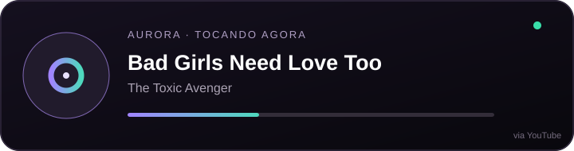
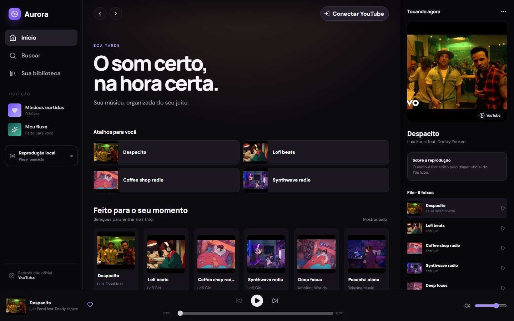

<div align="center">
  
  <h1>Aurora</h1>
  <p><strong>Minha música, organizada do meu jeito.</strong></p>
  <p>Um player pessoal inspirado no que eu gosto nas melhores experiências de streaming, usando o player e as APIs oficiais do YouTube.</p>
</div>



## O que já funciona

- login com Google OAuth em modo de testes;
- playlists reais da conta conectada, em modo somente leitura;
- reprodução pelo YouTube IFrame Player oficial;
- play, pausa, faixa anterior/próxima, volume, posição e avanço automático da fila;
- busca real com a conta conectada ou uma chave da YouTube Data API;
- curtidas e fila persistidas no dispositivo;
- layout responsivo para desktop e telas pequenas;
- estado local de “tocando agora” preparado para integrações.

## Aurora Now Playing

O aplicativo já registra a faixa e o estado de reprodução em tempo real no dispositivo. O SVG acima é a prévia visual do card que poderá ser colocado no perfil do GitHub.

Para torná-lo realmente ao vivo no GitHub ainda falta publicar um pequeno serviço: o GitHub não consegue ler o armazenamento de um navegador em `localhost`. Esse serviço receberá os eventos do Aurora e entregará um SVG público, sem expor o token do Google. Até essa etapa, o card deste README é demonstrativo e não deve ser confundido com telemetria ao vivo.

## Rodando localmente

Requisitos: Node.js 22 ou superior e um projeto no Google Cloud com a **YouTube Data API v3** habilitada.

```bash
npm install
copy .env.example .env.local
npm run dev
```

Preencha `VITE_GOOGLE_CLIENT_ID` no `.env.local`. `VITE_YOUTUBE_API_KEY` é opcional: com a conta conectada, a busca usa o token OAuth. O `.env.local` não é versionado.

```bash
npm test
npm run build
```

## Privacidade e limites

- O áudio e o vídeo são fornecidos pelo player oficial do YouTube.
- O Aurora não baixa nem intercepta mídia.
- O acesso OAuth está em modo de testes e limitado às contas autorizadas no Google Cloud.
- Tokens de acesso ficam apenas na memória da página e não entram no repositório.
- O projeto é uma experiência pessoal, sem afiliação com Google, YouTube ou Spotify.

## Próximas faixas

- card público “tocando agora” com autenticação segura;
- presença no Discord e extensão para VS Code;
- fila colaborativa por convite;
- empacotamento para Windows e Android.

## Uso

Código-fonte publicado como portfólio pessoal. Nenhuma licença de redistribuição ou uso comercial é concedida.
